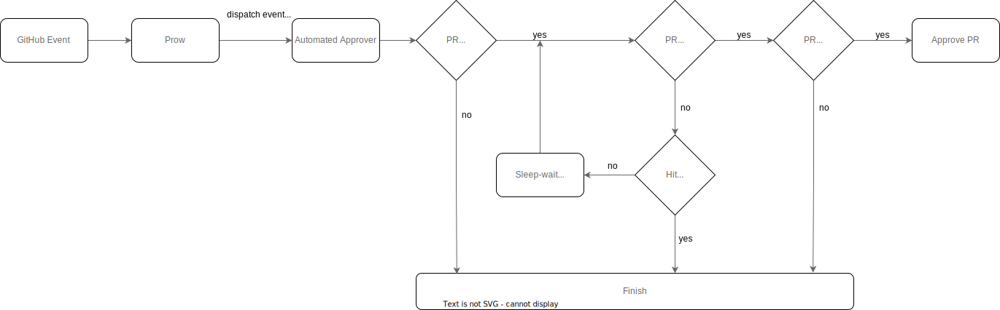

# Automated Approver

## Overview

With the Automated Approver tool, you can automatically approve a pull request (PR) based on the rules you define. The tool enables automation of the approval process for PRs in repositories that need reviews before merge. The tool automates the PR review process without limiting user `write` permission on the repository. It can provide an automated review process for all PR authors.

## How It Works

Automated Approver is a Prow plugin written in Golang. GitHub events are dispatched by Prow to the Automated Approver plugin. Automated Approver runs in a Prow Kubernetes cluster along with Prow components.

Automated Approver reacts to the following events:
 - PR review requested
 - PR synchronized
 - review dismissed

To identify PRs that must be approved by the tool, Automated Approver evaluates rules defined in the `rules.yaml` file. The rules are defined per organization, repository, or user entity. You can define the following conditions in the rules:
 - PR required labels
 - PR changed files

If a PR meets the conditions, the tool checks if the PR tests are finished. The `Tide` context is an exception: the `pending` status for `Tide` is ignored. The tool uses a backoff algorithm for sleep duration between subsequent status checks. A `wait-for-statuses-timeout` flag defines a timeout period while waiting for statuses to finish and reports its state back to GitHub. Once the tests are finished, it checks whether they were successful. Currently, the tool doesn't support optional tests. When all checks and conditions are met, the tool approves the PR.

Automated Approver uses the identity of a dedicated GitHub user to approve PRs. Depending on repository configuration, the user must have `write` permission on the repository, must be added to repository collaborators, and as a code owner in the `CODEOWNERS` file.

## How to Use It

You configure Automated Approver with CLI flags. The flags are defined in the following files in our repository and their dependencies:
- Automated Approver [configuration flags](https://github.com/kyma-project/test-infra/blob/5242421660dab5979a763bcd596eba48bafe093d/cmd/external-plugins/automated-approver/main.go#L39). 
- External plugin [configuration flags](https://github.com/kyma-project/test-infra/blob/5242421660dab5979a763bcd596eba48bafe093d/pkg/prow/externalplugin/externalplugin.go#L68) define the needed flags' values in the Pod specification and apply them to the Kubernetes cluster

Additionally, Automated Approver uses rules to approve PRs. You define the rules as a YAML file and apply them to the Kubernetes cluster as a ConfigMap. You must mount this ConfigMap to the Pod that runs Automated Approver.

## How to Install It

Automated Approver runs in a Kubernetes cluster. A Pod and service specification is defined in the Kubernetes [deployment manifest file](../../../prow/cluster/components/automated-approver_external-plugin.yaml). A service is required for Prow to dispatch GitHub events to registered external plugins.

The rules against which Automated Approver validates PRs are defined in a Kubernetes [ConfigMap manifest file](../../../configs/automated-approver-rules.yaml).

Automated Approver Kubernetes resources are managed by Terraform. Installation and updates are applied by running the `terraform apply` command automatically with our CI/CD system.
