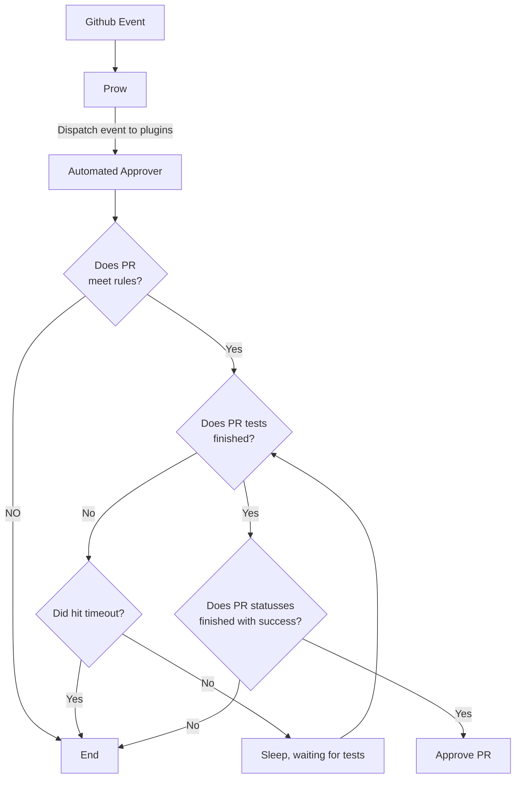

#Automated Approver

##Overview

Automated Approver is a tool that allows you to automatically approve pull requests based on the rules you define. It is written in Go. It runs in k8s cluster as a Prow plugin. It reacts on GitHub events. The tool allows automation of the approval process for pull requests in repositories which require reviews before merge. The tool automate PR review process without limiting user write permission on repository. It can provide automated review process for all pull request authors.

##How it works

Automated approver is a Prow plugin. GitHub events are dispatched by Prow to the Automated approver plugin. Automated approver runs in a prow k8s cluster along with Prow components.

Automated approver reacts on following events.
 - pull request review requested
 - pull request synchronized
 - review dismissed

To identify pull requests which should be approved by the tool, automated approver evaluates rules defined in rules.yaml file. Rules are defined per org/repo/user entity. Following conditions can be defined in rules.
 - pull request required labels
 - pull request changed files

If pull request meets conditions, the tool checks if pull request tests finished. A `Tide` context is an exception, pending status for `Tide` is ignored. The tool use backoff algorithm for sleep duration between subsequent statuses checks. A `wait-for-statuses-timeout` flag define a timeout waiting for statuses to finish and report it's state back to the GitHub. Once tests are finished, it checks if tests finished with success. At present the tool doesn't support optional tests. Once all checks and conditions are meet it approves pull request.

Automated Approver use identity of dedicated GitHub user to approve pull requests. Depending on repository configuration, the user must have write permission on repository, must be added to repository collaborators and be added as code owner in CODEOWNERS file.

##How to use it

Automated Approver is configured with cli flags. Flags are defined in following files in our repository and their dependencies.
Automated Approver [configuration flags](https://github.com/kyma-project/test-infra/blob/5242421660dab5979a763bcd596eba48bafe093d/cmd/external-plugins/automated-approver/main.go#L39)
External plugin [configuration flags](https://github.com/kyma-project/test-infra/blob/5242421660dab5979a763bcd596eba48bafe093d/pkg/prow/externalplugin/externalplugin.go#L68)
Define needed flags values in pod specification and apply it to k8s cluster.

Additionally, a tool is using rules for to approve pull requests. Rules are defined as yaml file and applied to k8s cluster as config map. You have to mount this config map to the pod running Automated Approver.

##How to install it

Automated Approver runs in k8s cluster. A pod and service specification is defined in k8s [deployment manifest file](../../../prow/cluster/components/automated-approver_external-plugin.yaml). A service is required for Prow to dispatch GitHub events to registered external plugins.

Rules against which Automated Approver validates pull requests are defined in k8s [config map manifest file](../../../configs/automated-approver-rules.yaml).

Automated Approver k8s resources are managed by Terraform. Installation and updates are applied by running `terraform apply` command. Command execution is automated with our CI/CD system.
