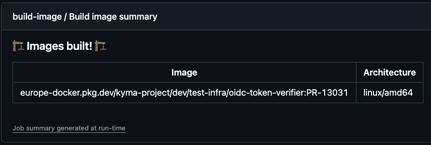

# Image Builder

Image Builder is a tool for building OCI-compliant images in an SLC-29-compliant system from a GitHub workflow.
It signs images with the Signify service and pushes them to Google Cloud Artifact Registry.

Key features:
* Automatically provides a default tag, which is computed based on a template provided in `config.yaml`
* Supports adding multiple tags to the image
* Supports pushing the same images to multiple repositories
* Supports caching of built layers to reduce build times
* Supports signing images with the Signify service
* Supports pushing images to the Google Cloud Artifact Registry
* Supports building images for multiple architectures
* Supports building images for the Chainguard images, which are used on restricted markets that are not publicly available

## Quickstart Guide

Use Image Builder in your GitHub workflow to build an image in an SLC-29-compliant system.

See an example of a GitHub workflow building an image using Image Builder:

```yaml
name: pull-image-builder-test

on:
   pull_request_target:
      types: [ opened, edited, synchronize, reopened, ready_for_review ]
      paths:
         - ".github/workflows/pull-image-builder-test.yml"
         - ".github/workflows/image-builder.yml"
         - ".github/actions/expose-jwt-action/**"
         - ".github/actions/image-builder/**"

permissions:
   id-token: write # This is required for requesting the JWT token
   contents: read # This is required for actions/checkout

jobs:
   compute-tag:
      runs-on: ubuntu-latest
      outputs:
         tag: ${{ steps.get_tag.outputs.TAG }}
      steps:
         - name: Checkout
           uses: actions/checkout@v4
         - name: Get the latest tag
           id: get_tag
           run: echo ::set-output name=TAG::"v0.0.1-test"
         - name: Echo the tag
           run: echo ${{ steps.get_tag.outputs.TAG }}
   build-image:
      needs: compute-tag
      uses: kyma-project/test-infra/.github/workflows/image-builder.yml@main # Usage: kyma-project/test-infra/.github/workflows/image-builder.yml@main
      with:
         name: test-infra/ginkgo
         dockerfile: images/ginkgo/Dockerfile
         context: .
         tags: ${{ needs.compute-tag.outputs.tag }}
         platforms: |
            linux/amd64
   test-image:
      runs-on: ubuntu-latest
      needs: build-image
      steps:
         - name: Test image
           run: echo "Testing images ${{ needs.build-image.outputs.images }}"
```

The example workflow consists of the following three jobs:

1. `compute-tag`: Computes the tag for the image. It uses the `get_tag` step output to pass the tag to the `build-image` job.
2. `build-image`: Builds the image using the Image Builder reusable workflow.
   It uses the `kyma-project/test-infra/.github/workflows/image-builder.yml@main` reusable workflow to
   build the `test-infra/ginkgo` image, using the Dockerfile from the `images/gingko/Dockerfile` path.
   The build context is the current directory which effectively means the repository root.
   It uses the `envs` file to load environment variables.
   The image is tagged with the tag computed in the `compute-tag` job.
3. `test-image`: Tests the image build in the `build-image` job. It uses the `build-image` job output to get the image name.

## Reusable Workflow

### Workflow Permissions

The Image Builder reusable workflow requires permissions to access the repository and get the OIDC token from the GitHub identity provider.
You must provide the following permissions to the workflow or the job that uses the reusable workflow:

```yaml
permissions:
   id-token: write # This is required for requesting the OIDC token
   contents: read # This is required for actions/checkout
```

### Supported Events

The Image Builder reusable workflow supports the following GitHub events to trigger a workflow:

* **push** - to build images on push to the specified branch.
* **merge_group** - to build images on merge group events.
* **pull_request_target** - to build images on pull requests.
* **workflow_dispatch** - to manually trigger the workflow.
* **schedule** - to build images on a regular basis.

### Reusable Workflow Reference

The workflow that uses the Image Builder reusable workflow must use the exact reference to the reusable workflow.
The value of the `uses` key must be `kyma-project/test-infra/.github/workflows/image-builder.yml@main`.

```yaml
uses: kyma-project/test-infra/.github/workflows/image-builder.yml@main
```

> [!WARNING]
> Using different references to the reusable workflow results in an error during the workflow execution.

### Reusable Workflow Inputs

The Image Builder reusable workflow accepts inputs to parametrize the build process.
See the accepted inputs description in the [image-builder reusable workflow](/.github/workflows/image-builder.yml) file.

### Reusable Workflow Outputs

The Image Builder reusable workflow provides outputs to pass the results of the build process.
See the provided outputs description in the [image-builder reusable workflow](/.github/workflows/image-builder.yml) file.

### Reusable Workflow Summary

The Image Builder reusable workflow provides a summary of the build process.
The summary includes the following information:

* The full name with the tag of the image built.
* The Architecture of the image built.



## Tags

### Default Tags

Image Builder provides default tags for built images.
The default tag is computed based on the template provided in the Image Builder configuration file.
The default tag is always added to the image, even if the user provides custom tags.
Image Builder supports two default tags:

* **Pull Request Default Tag**: The default tag template for images built on pull requests is `pr-<PR_NUMBER>`, for example: `PR-123`.
* **Push Default Tag**: The default tag template for images built on push, schedule, and manual triggers is `v<DATE>-<SHORT_SHA>`, for example: `v20210930-1234567`.

### Named Tags

For information on named tags, see [Named Tags](image-builder.md#named-tags).

## Build Args

By default, Image Builder passes the following build arguments to the Docker build process:

- **BUILD_COMMIT_SHA**: The commit SHA that the image is built from.

## Image Repositories Supported for Pushes

Image Builder pushes images to Google Cloud Artifact Registry.

**Default repositories**

- Images built on pull requests are pushed to the development repository: `europe-docker.pkg.dev/kyma-project/dev`.
- Images built on **push** event are pushed to the production repository: `europe-docker.pkg.dev/kyma-project/prod`.

**Restricted registries**

Image Builder supports pushing images to internal (restricted) registries.
When `use-restricted-registry` is enabled, Image Builder pushes to the following repositories:

- Pull-request builds: `europe-docker.pkg.dev/kyma-project/kyma-restricted-images-dev`
- Push builds: `europe-docker.pkg.dev/kyma-project/kyma-restricted-images-prod`

> [!NOTE]
> These restricted *push* repositories are writable only by the Image Builder pipeline.

### Obtaining the Image Pull URL

After a successful build, the final image URI is printed in the build output and job summary. Use that URI to pull the image. The general URI format is the following:

```
europe-docker.pkg.dev/kyma-project/<repository>/<image-name>:<tag>
```

Where:

- `<repository>` is `dev` for pull-request builds or `prod` for push builds. If restricted mode is enabled, Image Builder pushes to internal restricted push repositories and consumers should pull from the corresponding virtual (read) repositories (see 'Restricted registries' below).
- `<image-name>` is the `name` input passed to the reusable workflow.
- `<tag>` is the tag provided via the `tags` input or the default tag computed by Image Builder.

**Restricted registries**

When `use-restricted-registry` is enabled, Image Builder pushes to internal (restricted) push repositories and exposes virtual (read) repositories for consumers:

- Pull (pull request builds): `europe-docker.pkg.dev/kyma-project/restricted-dev`
- Pull (push builds): `europe-docker.pkg.dev/kyma-project/restricted-prod`

See an example pull URI for a pull request build in restricted mode:

```
europe-docker.pkg.dev/kyma-project/restricted-dev/<image-name>:<tag>
```

Notes:

- Consumers must have the appropriate IAM permissions to pull from restricted virtual repositories.

## Image Signing

By default, Image Builder signs images with the production Signify service.
Image signing allows verification that the image comes from a trusted repository and has not been altered in the meantime.

> [!NOTE]
> Image Builder only signs images built on the **push**, **schedule**, and **workflow_dispatch** events. Images built on the **pull_request_target** and **merge_group** event are not signed.

### OCI-Compliant Image Signing Process

Image Builder implements signing based on the following image types:

- **OCI Image Index Images**: For images (supporting multiple platforms like linux/amd64, linux/arm64), Image Builder performs the following actions:
    1. Detects the image index using OCI registry APIs
    2. Retrieves the image index digest and size
    3. Signs the entire `manifest-list.json`
    4. Stores signatures according to Notary v2 specifications

- **OCI Image Manifest Images**: For images built for one specific architecture, Image Builder performs the following actions:
    1. Retrieves the image manifest digest directly
    2. Signs the image manifest digest
    3. Associates the signature with the specific image version

## Azure DevOps Backend (ADO)

Image Builder uses the ADO `oci-image-builder` pipeline as a build backend,
which means the images are built, signed, and pushed to the Google Cloud Artifact Registry in the ADO pipeline.
Image Builder does not build images locally on GitHub runners.

## Jenkins Integration

> [!NOTE]
> **Usage Limitation**: This feature is intended exclusively for the SRE team. It is not supported for use by other teams or projects.

Image Builder includes basic integration with Jenkins.
This integration allows the `image-builder` binary to gather inputs directly from the Jenkins pipeline runtime environment.

- **Purpose**: This feature is specifically designed for integration with the SRE Jenkins pipelines and **does not provide a simplified or
  enhanced workflow experience** comparable to the GitHub workflow approach.
- **Build Report**: A dedicated flag (`--build-report-path`) has been added to the `image-builder` binary, enabling it to write a build
  report generated by the ADO pipeline to a specified file. This functionality is intended specifically for use in Jenkins.

## Cross-Compiling and Caching for Non-Native Architecture Builds

Image Builder uses builder agents with `linux/amd64` native architecture.
When building images for multiple architectures or building an image for a non-native architecture,
consider enabling cross-compilation to significantly reduce build times.
Testing has shown that cross-compilation can speed up the build process by **10x**, reducing build times from 12 minutes to less than 2 minutes in our test scenario with a rather small golang codebase.

### Key Recommendations

- **Cross-Compilation**: If you are building non-native architecture images, implement cross-compilation in your Dockerfile, use
  the [Faster Multi-Platform Builds: Dockerfile Cross-Compilation Guide](https://www.docker.com/blog/faster-multi-platform-builds-dockerfile-cross-compilation-guide/)
  as a reference.
- **Bind Mounts**: To avoid copying source code for compilation, use bind mounts for the `RUN` command in Dockerfiles.
  However, the speed gain was minimal in our tests: We achieved a speedup of less than ~5 seconds.
- **Cache Mounts for Go Compiler**:
  Rely on a **cache backed by a remote repository**, because a new agent is allocated for each pipeline execution, making mount-type caching
  ineffective.
  Use mounts a cache type for Go package downloads. The binary compilation cache did not increase speed during tests.

### Example Dockerfile to Build Publicly Available Images

```dockerfile
FROM --platform=$BUILDPLATFORM golang:1.24.2-alpine3.21 AS builder

WORKDIR /app

COPY go.mod go.sum ./
RUN go mod download -x

ARG TARGETOS TARGETARCH
RUN --mount=target=. cd /app/cmd/image-builder && CGO_ENABLED=0 GOOS=$TARGETOS GOARCH=$TARGETARCH go build -buildvcs=false -o /image-builder -a -ldflags '-extldflags "-static"' .

FROM scratch

COPY --from=builder /image-builder /image-builder

ENTRYPOINT ["/image-builder"]
```

### Example Dockerfile to Build Restricted Images

```dockerfile
FROM europe-docker.pkg.dev/kyma-project/restricted-dev/sap.com/python-fips:latest
WORKDIR /app

COPY requirements.txt ./
RUN pip install --no-cache-dir -r requirements.txt

COPY . .

CMD ["python", "-m", "your_module"]
```