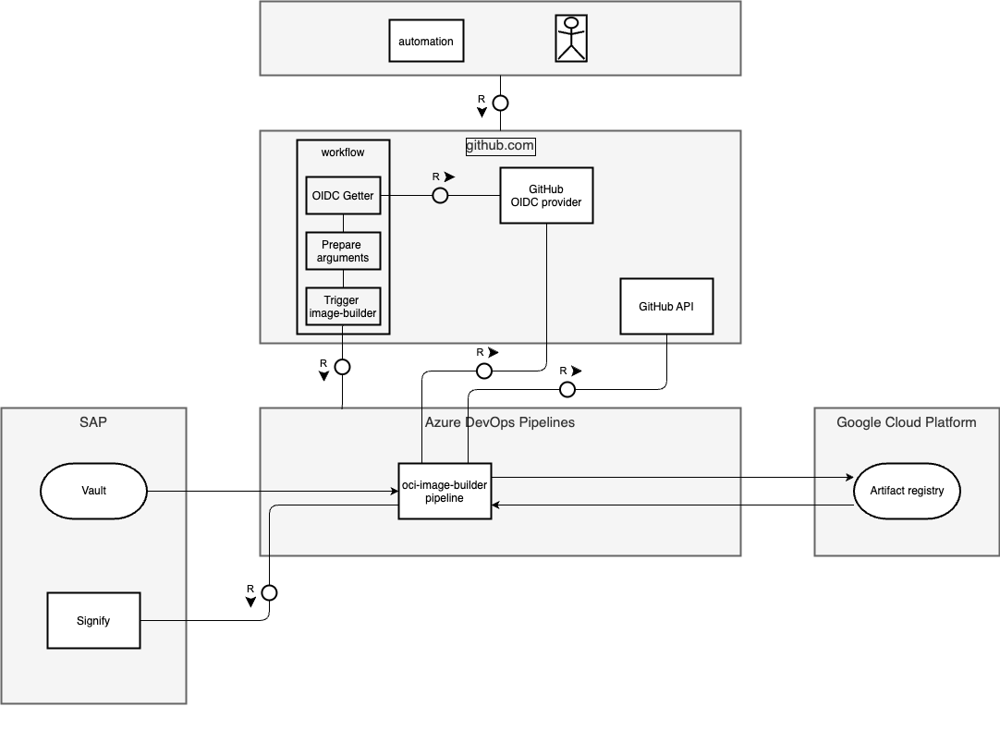
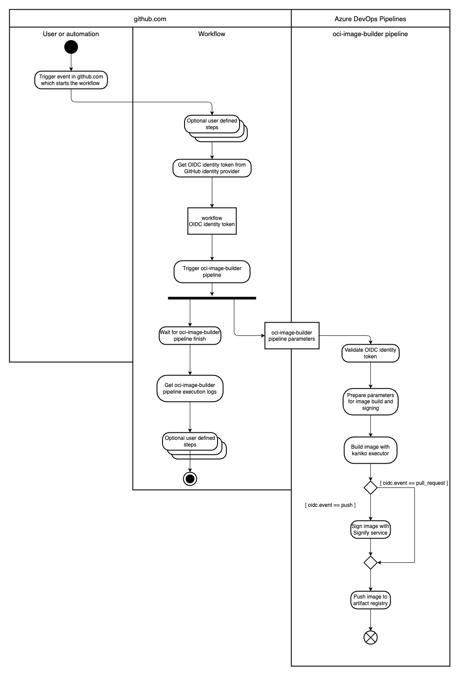

# Image Builder GitHub Workflow Integration

The Image Builder solution integrates with GitHub workflows and uses an Azure DevOps pipeline to run the process of building OCI
images. It leverages a signed JWT format in which an OIDC token from GitHub's OIDC identity provider is passed. This token is used for
authentication and authorization the reusable workflow that trigger the `oci-image-builder` pipeline. The build
process is executed in an Azure DevOps pipeline, providing an SLC-29-compliant infrastructure for building OCI images.

## Process Flow

1. **Trigger workflow**: The user or automation triggers a GitHub workflow. The workflow calls image-builder reusable workflow to build the
   OCI image. The image-builder reusable workflow is stored in the github.com/kyma-project/test-infra repository in the main branch. The
   image-builder reusable workflow defines inputs which are used to pass user-defined parameters to the `oci-image-builder` pipeline.

2. **Verify repository owner**: The image-builder reusable workflow verifies the repository owner of repository where the caller workflow
   runs.
   The repository owner must be `kyma-project`.
   This step ensures that the image-builder reusable workflow is used only by workflows running in repositories owned by `kyma-project`.

2. **Obtain the OIDC Token**: The image-builder reusable workflow uses GitHub action to call GitHub's OIDC identity provider, issuing an
   OIDC token. The token is passed as value of `AUTHORIZATION` parameter in a ADO API call.
   This token is used to authenticate image-builder reusable workflow in the ADO backend.

3. **Get ADO PAT**: The image-builder reusable workflow uses GitHub action to get the Azure DevOps (ADO) Personal Access Token (PAT)
   from Google Secret Manager. The PAT is used to authenticate in the ADO API.

3. **Trigger the `oci-image-builder` pipeline**:
   The image-builder reusable workflow uses Image Builder GitHub action to collect required data and to trigger the `oci-image-builder`
   pipeline.
   Required data is collected from inputs to the Image Builder reusable workflow defined by the user and GitHub workflow context variables.

4. **Validating the OIDC Token**: The `oci-image-builder` pipeline, running in ADO, validates the OIDC token against trusted issuer.
   The pipeline validates the claims in the OIDC token to ensure that the workflow is authorized to trigger the build process.
   Only if the token is valid and pipeline was triggered by trusted workload, the pipeline will proceed to the next step.

5. **OCI Image build preparation**: The `oci-image-builder` pipeline uses the information from pipeline parameters to clone appropriate
   source code for the building of the OCI image.
   It uses the information from pipeline parameters to set the appropriate parameters for the build and signing images too.

6. **Building the OCI Image**: The `oci-image-builder` pipeline proceeds to build the OCI image.
   The build process uses a kaniko executor as a build engine.

7. **Pushing the OCI Image**: After the OCI image is built, it is pushed to a specified OCI registry.
   The `oci-image-builder` pipeline pushes the OCI image to dev or prod registry, depending on the event that triggered the pipeline.

8. **Signing the OCI Image**: If the build was triggered by a push GitHub event, the `oci-image-builder` pipeline uses the `signify`
   service to sign the OCI image.

## Image Builder Reusable Workflow

Image-builder reusable workflow is a GitHub workflow used to collect required data from workflow inputs and GitHub context variables.
It retrieves the OIDC token from GitHubs OIDC identity provider, and ADO PAT from Google Secret Manager.
Using the reusable workflow we bundle all the steps required to collect the data
and trigger the `oci-image-builder` pipeline in a controlled and secure environment.
Using an OIDC token allows `oci-image-builder` ADO pipeline
to confirm the version and identity of the reusable workflow that triggered the build process.
The image-builder reusable workflow collects needed data from reusable workflow inputs and GitHub context variables.
The workflow triggers `oci-image-builder` pipeline
using [Image Builder GitHub Action](https://github.com/kyma-project/test-infra/blob/main/.github/actions/image-builder/README.md).
The image-builder reusable workflow is stored in the `github.com/kyma-project/test-infra` repository on the `main` branch, and changes to
the workflow are versioned and provided using pull requests.
Together with CODEOWNERS file mechanism, this ensures that the changes to the workflow are reviewed and approved by the appropriate team
members.
This protects the workflow from unauthorized changes and ensures that the workflow is secure and reliable.
The workflow that uses an image-builder reusable workflow must reference the workflow version referenced by
`kyma-project/test-infra/.github/workflows/image-builder-reusable.yml@main`.

## GitHub OIDC Identity Token Claims

The OIDC token issued by GitHub's OIDC identity provider contains several claims that are crucial for the `oci-image-builder` pipeline.
These claims are used to identify the workflow triggering the build pipeline.
This is essential for SLC-29 compliance, as it ensures that only trusted clients can build and sign image.

The validity and integrity of the OIDC token is validated in the `oci-image-builder` pipeline following standard oidc token validation.
Apart from validation of standard claims, the `oci-image-builder` pipeline also validates custom claims specific for the token issuer.

### Workflow Identification Claims

The OIDC token contains the following claims that can be used to identify the workflow that triggered the build pipeline.

<!-- markdown-link-check-disable -->

- **iss**: The issuer of the token. <!-- markdown-link-check-enable-->
- **event_name**: The name of the event that triggers the workflow run.
- **repository_owner**: The owner of the repository where the workflow run occurs.
- **job_workflow_ref**: For jobs using a reusable workflow, the ref path to the reusable workflow. For more information,
  see [Using OpenID Connect with reusable workflows.](https://docs.github.com/en/actions/deployment/security-hardening-your-deployments/using-openid-connect-with-reusable-workflows)

## Parameters for the `oci-image-builder` Pipeline

The `oci-image-builder` pipeline requires certain data to be provided in parameters to execute a build process.
Certain parameters need to be defined by the user in addition to the data taken from the GitHub context variables.

### Parameters from Image Builder Reusable Workflow Inputs

- **Context**: The context of the build.
- **Dockerfile**: The Dockerfile to be used for the build.
- **Name**: The name of the image.
- **BuildArgs**: The build arguments to be passed to the build.
- **Tags**: The tags to be applied to the image.
- **ExportTags**: Whether to export the tags.
- **EnvFile**: The environment variables file.

See the list of reusable workflow inputs in
the [image-builder.yml](https://github.com/kyma-project/test-infra/blob/main/.github/workflows/image-builder.yml#L5-L40)

### Parameters from GitHub Context Variables

- **PullBaseSHA**: The base SHA of the pull request.
- **PullPullSHA**: The SHA of the pull request.
- **PullNumber**: The number of the pull request.
- **RepoName**: The name of the repository.
- **RepoOwner**: The owner of the repository. Allowed value is `kyma-project`.
- **JobType**: The type of job. Allowed values are `presubmit` and `postsubmit`.

## Azure DevOps Pipeline

The `oci-image-builder` pipeline is an Azure DevOps pipeline that is triggered by the image-builder reusable workflow.
The pipeline is responsible for building, pushing, and signing the OCI image.
The pipeline uses [oidc-token-verifier](https://github.com/kyma-project/test-infra/blob/main/cmd/oidc-token-verifier/README.md) to validate
the OIDC token.
The pipeline execution output is retrieved by the image-builder reusable workflow and returned to the caller workflow as output.
The URIs of the pushed images are retrieved by the image-builder reusable workflow and returned to the caller workflow as output.

See the reusable workflow outputs in
the [image-builder.yml](https://github.com/kyma-project/test-infra/blob/main/.github/workflows/image-builder.yml#L41-L47)

## Block Diagram

## Activity Diagram

## Conclusion

The Image Builder solution, with its seamless integration with GitHub workflows and Azure DevOps pipeline, offers developers a robust and
secure method to incorporate the building of OCI images into their workflows. By leveraging a signed JWT format in which an OIDC token from
GitHub's OIDC identity provider is passed, it ensures the secure and authorized passing of information about the workflow and the image to
build. The entire build process adheres to SLC-29 compliance, providing a reliable infrastructure for the building of OCI images.