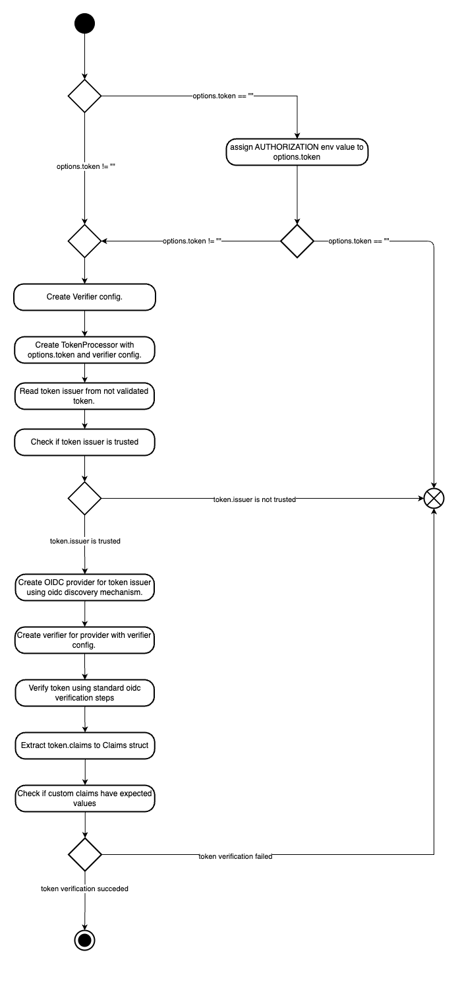

# OIDC Token Verifier

The OIDC Token Verifier is a command-line tool designed to validate the OIDC token and its claim values. It is primarily used in the
oci-image-builder Azure DevOps pipeline to authenticate and ensure the integrity of the token passed to the pipeline.

At present, the tool supports only the GitHub.com OIDC identity provider and the RS256 algorithm for verifying the token signature.

## How to Use

Run the OIDC Token Verifier passing a raw OIDC token in the `token` flag or in the `AUTHORIZATION` environment variable.
Token passed in the `token` flag will take precedence over the token passed in the `AUTHORIZATION` environment variable.

```bash
oidc-token-verifier --token "your-oidc-token"
```

See all available [flags](https://github.com/kyma-project/test-infra/blob/main/cmd/oidc-token-verifier/main.go#L45-L55).

If a token is issued by the trusted issuer, the tool will validate the token against it.
If the token is valid and the claims are as expected, the tool will exit with a status code of 0.
Otherwise, it will exit with a status code of 1.

Apart from standard OIDC token validation, the tool will validate the following claim values:

- `iss` - the issuer of the token
- `aud` - the audience of the token
- `job_workflow_ref` - the reference of the GitHub reusable workflow used in the calling GitHub workflow

> [!IMPORTANT]
> Trusted issuer and allowed workflow reference are hardcoded in the tool.
> The issuer is set to `https://token.actions.githubusercontent.com`.
> The workflow reference is set to `kyma-project/test-infra/.github/workflows/image-builder.yml@refs/heads/main`
> This is a temporary solution and will be replaced with a more flexible configuration in the future.
> See [issue](https://github.com/kyma-project/test-infra/issues/11000) for more details.

## How it works

- the OIDC discovery
- the token and claims verification
- hardcoded trusted issuer and workflow, link to issue

The OIDC Token Verifier is designed to validate provided OIDC token and its claim values and provide a status code based on the validation
result.
The tool is not expected to be used as a long-running service but rather as a command-line tool that is run on demand as part of a larger
pipeline.
It reads the token issuer and verifies it against the trusted issuer. If the issuer is trusted, the tool proceeds to validate the token.
During the token validation, the tool uses the OIDC discovery to get the public key used to sign the token.
Once the token passes standard OIDC validation, the tool verifies the token claim values.
The tool verifies the following claim values:

- `job_workflow_ref` - the reference of GitHub reusable workflow used in the calling GitHub workflow,
  it must match the value in `Issuer.ExpectedJobWorkflowRef` field of trusted issuer.

If the token is valid and all claim values are as expected, the tool will exit with a status code of 0, indicating that the token is valid.
Otherwise, it will exit with a status code of 1, indicating that the token is invalid.

### Activity Diagram



## Use Case

### oci-image-builder Pipeline

The tool was developed to be used in the oci-image-builder pipeline, where it authenticates and authorizes calls that trigger the pipeline.
By verifying the tokens and validating its claims against allowed values, it prevents unauthorized or malicious image builds.
This is done by ensuring that the token is issued by the trusted issuer and that the token is used in the context of the trusted GitHub
workflow reference.