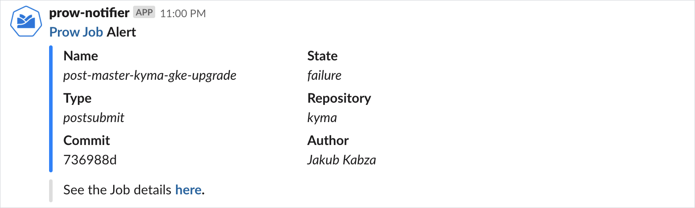

# Prow Addons Controller Manager

## Overview

The Prow Addons Controller Manager contains all custom controller extensions for Prow infrastructure. This project is bootstrapped by Kubebuilder. Check the official [Kubebuilder](https://github.com/kubernetes-sigs/kubebuilder/tree/v1.0.7) documentation to find out how to work with the project.

## Prerequisites

Use the following tools to set up the project:

* Version 1.11 or higher of [Go](https://golang.org/dl/)
* Version 0.5.1 or higher of [Dep](https://github.com/golang/dep)
* Version 2.0.0 of [Kustomize](https://github.com/kubernetes-sigs/kustomize)
* Version 1.0.7 of [Kubebuilder](https://github.com/kubernetes-sigs/kubebuilder)
* The latest version of [Docker](https://www.docker.com/)
* The latest version of [Mockery](https://github.com/vektra/mockery)

## Available controllers

### Notifier
Notifier watches all Prow jobs and sends notifications to a given Slack channel:



For information about the available configuration, see the [**Use environment variables**](#use-environment-variables) section.

To ignore the Prow job, add the **prow.kyma-project.io/slack.skipReport** label under the **metadata** entry in the job definition and set it to `true`.
```yaml
postsubmits:
  - name: post-master-kyma-gke-upgrade
    branches:
    - ^master$
    labels:
      prow.kyma-project.io/slack.skipReport: true # this job will be ignored by Slack reporter
      preset-bot-github-token: "true"
      preset-build-master: "true"
    skip_report: false
  ...
```

## Usage

### Run a local version

To run the controller outside the cluster, run this command:

```bash
make run
```

### Build a production version

To build the production Docker image, run this command:

```bash
IMG={image_name}:{image_tag} make docker-build
```

The variables are:

* `{image_name}` which is the name of the output image.
* `{image_tag}` which is the tag of the output image.

### Use environment variables
Use the following environment variables to configure the application:

| Name | Required | Default | Description |
|-----|---------|--------|------------|
| **NOTIFIER_GITHUB_ACCESS_TOKEN** | Yes |  | The GitHub token for querying GitHub API. |
| **NOTIFIER_SLACK_TOKEN** | Yes | | The Slack token used to publish messages on a Slack channel. Find more information [here](https://api.slack.com/docs/token-types#bot). |
| **NOTIFIER_SLACK_REPORTER_CHANNEL** | Yes |  | The Slack channel name where you want to post notifications. You can specify the `general` public channel, a private channel, or an IM channel. For example, to specify the public channel, pass the `#general` channel name. Find more information [here](https://api.slack.com/methods/chat.postMessage#channels).|
| **NOTIFIER_SLACK_REPORTER_ACT_ON_PROW_JOB_TYPE** | No | `periodic;postsubmit` | The names of the Prow job types you want to observe. Separate multiple type names by a comma or a semicolon. Find the acceptable job types [here](https://github.com/kubernetes/test-infra/blob/fbc4040f1824bfa126f873650848396a10f05e8a/prow/apis/prowjobs/v1/types.go#L33-L43).
| **NOTIFIER_SLACK_REPORTER_ACT_ON_PROW_JOB_STATE** | No | `failure;error` | The names of the Prow job states you want to observe. Multiple state names should be separated by comma or semicolon. Find the acceptable job states [here](https://github.com/kubernetes/test-infra/blob/fbc4040f1824bfa126f873650848396a10f05e8a/prow/apis/prowjobs/v1/types.go#L48-L62).
| **NOTIFIER_SLACK_REPORTER_USER_ICON_EMOJI** | No | `:prow:`  | The Slack bot user name.
| **NOTIFIER_SLACK_REPORTER_USERNAME** | No | `prow-notifier` | The Emoji to use as the icon for a Slack notification message.

### Project structure

<!-- Update the repository structure each time you modify it. -->

The `prow-addons-ctrl-manager` project has the following structure:

```
  .
  ├── Dockerfile                # The definition used to build the Docker image
  ├── Makefile                  # All commands required to work with the project, such as "test" or "deploy"
  ├── bin                       # The destination for the project's compiled binaries  
  ├── cmd                       # The entrypoint for the main application of this project
  ├── config
  │   ├── crds                  # The CRDs definition used in this project. Do not edit it.
  │   ├── default               # Default patches and resources for "manager.yaml"
  │   ├── deploy                # A combined set of resources generated by the "kustomize" tool  
  │   ├── kustomization.yaml    # Instructions for the "kustomize" tool
  │   ├── manager               # Basic resources for the Controller Manager, such as StatefulSet and ServiceAccount
  │   └── rbac                  # RBAC resources autogenerated by the "kustomize" tool based on an annotation in the source code. Do not edit them.
  ├── docs                      # Documentation for the project architecture
  ├── hack                      # Non-build-related scripts
  └── pkg                       # The controller source code
```

## Development

### Install dependencies

This project uses `dep` as the dependency manager. To install all required dependencies, use the following command:
```bash
make resolve
```

### Run tests

To test your changes before each commit, use the following command:

```bash
make test
```
