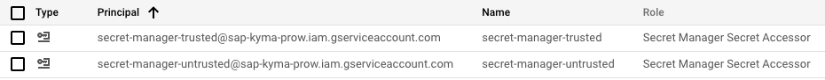

# Add custom secret to Prow

This tutorial shows how to add a custom secret and use it in the Prow pipeline.
## Procedure

1. Create a new Secret in the Secret Manager. The Secret name should be in the following format: `<component>-<tool>-<secret-name>`. For example: `security-dashboard-github-bot-token`. The Secret should contain the following fields:
   - `secret value` - the value of the secret, for example, the GitHub token,
   - `description` - the description of the secret in the `Annotations description` field. For example: `GitHub token for the Security dashboard Github bot`.

2. Apply `owner` label to the secret in Secret Manager that will help identify the owner of a secret. For example: `owner: neighbors`.
3. Apply `type` label to the secret in Secret Manager that will help identify the owner of a secret. For example: `type: service-account`.
   
4. Apply the necessary permissions. Add the `secret-manager-trusted@sap-kyma-prow.iam.gserviceaccount.com` principal with the `Secret Manager Secret Accessor` role if the secret will be used only for a postsubmit or release job. If you are creating a Secret for a presubmit job, use `secret-manager-untrusted@sap-kyma-prow.iam.gserviceaccount.com` principal with the same role. If you want to use the secret in presubmit and postsubmit jobs, apply both principals.



5. Update External Secrets Operator YAML file.

    Add External Secret definitions to one of the following files:
    - [external_secrets_trusted.yaml](https://github.com/kyma-project/test-infra/blob/main/prow/cluster/resources/external-secrets/external_secrets_trusted.yaml) if the secret is applied only on trusted cluster (applicable for postsubmit or release job).
    - [external_secrets_untrusted.yaml](https://github.com/kyma-project/test-infra/blob/main/prow/cluster/resources/external-secrets/external_secrets_untrusted.yaml) if the secret is applied only on untrusted cluster (applicable for presubmit job).
    - [external_secrets_workloads.yaml](https://github.com/kyma-project/test-infra/blob/main/prow/cluster/resources/external-secrets/external_secrets_workloads.yaml) if the secret is applied on both clusters (applicable for presubmit and postsubmit jobs).

6. Apply the Secrets manually in the Prow cluster as Kubernetes External Secret.

7. Create ProwJob Preset in [prow-config.yaml ](../../prow/config.yaml) that maps the Secret to the variable or to the file.

    For example:

    ```yaml
    - labels:
        preset-kyma-btp-manager-bot-github-token: "true"
        env:
        - name: BOT_GITHUB_TOKEN
          valueFrom:
            secretKeyRef:
                name: kyma-btp-manager-bot-github-token
                key: token
    ```

    Now you can use the Preset in your job definition and refer to the Secret in your pipeline.
