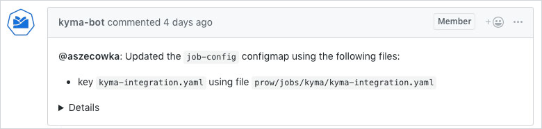

# Manage Component Jobs with Templates

This document describes how to define, modify, and remove Prow jobs for Kyma components using predefined templates that create both presubmit and postsubmit jobs for your component. Also, this document gives you the steps required to prepare your component for the Prow CI pipeline.

<div tabs name="add-component-jobs">
  <details>
  <summary>
  Add component jobs
  </summary>

Follow these steps:

1. Edit the configuration file.

   Go to `templates/data/generic_component_data.yaml` and add a new entry with your component details to the `render` list under the `templates` section.
   
   See an example that defines the `compass-runtime-agent` component from the `kyma` repository, using the generic bootstrap:

   ```yaml
   templates:
   - from: generic.tmpl
     render:
      - to: ../../prow/jobs/kyma/components/compass-runtime-agent/compass-runtime-agent-generic.yaml
        jobConfigs:
         - repoName: "github.com/kyma-project/kyma"
           jobs:
            - jobConfig:
              path: components/compass-runtime-agent
              args:
              - "/home/prow/go/src/github.com/kyma-project/kyma/components/compass-runtime-agent"
              run_if_changed: "^components/compass-runtime-agent/|^common/makefiles/"
              release_since: "1.7"
              optional: true
           ...
   ```

   Such an entry uses the `generic.tmpl` template to create the `compass-runtime-agent-generic.yaml` file under the `/prow/jobs/kyma/components/compass-runtime-agent/` subfolder, specifying that the presubmit and postsubmit jobs for this component should apply from the `1.7` release onwards.
   Set the **optional** parameter to `true` for this job to be optional on pull requests (PRs), not to block others.

   If needed, you can add global Config Sets (**globalSets**) to the `templates/config.yaml` file.

   For more information about creating template files, as well as local config sets (**localSets**), job configs (**jobConfig**), and (**globalSets**), read [Render Templates](../../pkg/tools/rendertemplates).
   > **CAUTION:** The `.yaml` file and the component folder name should be the same as the name of the Kyma component. Also, all `.yaml` files in the whole `jobs` structure must have unique names.
   
   Use the buildpack for Go or Node.js applications provided in the `test-infra` repository. It is the standard mechanism for defining Prow jobs. If the buildpack you want to use is not there yet, you must add it. When you add a new buildpack, follow the example of the already defined ones.

2. Generate jobs.

   Run this command to generate jobs previously defined in the `config.yaml` file:
   ```bash
   make jobs-definitions
   ```

   As a result, the Render Templates tool generates the requested job files.

   For more information about generating jobs, read [Render Templates](../../cmd/tools/rendertemplates/README.md).


3. Check your configuration locally.

   Use the `development/validate-config.sh` script to validate your Prow configuration. The script accepts three arguments:

   - The path to the plugins configuration file (`prow/plugins.yaml`)
   - The path to the generic configuration file (`prow/config.yaml`)
   - The path to the directory with job definitions (`prow/jobs/`)

   See an example:

   ```bash
   cd $GOPATH/src/github.com/kyma-project/test-infra
   ./development/validate-config.sh prow/plugins.yaml prow/config.yaml prow/jobs/
   ```

4. Merge the changes.

   Create a PR with your changes in the `generic_component_data.yaml` file and the job files generated by the Render Templates tool.

   After your PR is reviewed and approved, merge the changes to the `test-infra` repository. The job configuration is automatically applied to the Prow production cluster. The `config_updater` plugin configured in the `prow/plugins.yaml` file adds a comment to the PR:



5. Create a Makefile for your component.

   Buildpacks need a `Makefile` defined in your component directory under the `kyma` repository. The `Makefile` must define the **ci-release** target that is executed for a PR issued against the release branch.

   See an example of `Makefile` for the Central Application Gateway component that already uses the generic buildpack:

   ```Makefile
   APP_NAME = central-application-gateway
   APP_PATH = components/$(APP_NAME)
   BUILDPACK = eu.gcr.io/kyma-project/test-infra/buildpack-golang:v20210607-b7e95d8b
   SCRIPTS_DIR = $(realpath $(shell pwd)/../..)/common/makefiles
   
   override ENTRYPOINT = cmd/applicationgateway/
   
   include $(SCRIPTS_DIR)/generic-make-go.mk
   
   VERIFY_IGNORE := /vendor\|/mocks
   
   release:
        $(MAKE) gomod-release-local
   
   resolve-local:
        GO111MODULE=on go mod vendor -v
   
   test-local:
        GO111MODULE=on go test ./...
   
   .PHONY: path-to-referenced-charts
   path-to-referenced-charts:
        @echo "resources/application-connector"
   ```

   > **NOTE** Add a tab before each command.

   If your job involves pushing a Docker image, its name is based on the following environment variables:
   
   - **DOCKER_TAG** that refers to the Docker tag set by the `build.sh` script.
   - **DOCKER_PUSH_DIRECTORY** that points to the directory in the Docker repository where the image is pushed. Set it in the job definition by adding the **preset-build-pr**, **preset-build-main**, or **preset-build-release** Preset.
   - **DOCKER_PUSH_REPOSITORY** that is the Docker repository where the image is pushed. It is set in the job definition by the **preset-docker-push-repository** Preset.


6. Make your component job and test obligatory.

   Create another PR in the `test-infra` repository that removes these entries:
   
   - `optional: true` from your component job definition in `templates/config.yaml`.
   - `jobsuite.Optional()` from your component test definition in `components_test.go`.
   
   This change makes your component job and test obligatory to pass on all PRs before they can be merged.

</details>
<details>
<summary>
Modify component jobs
</summary>

To change component job configuration, follow these steps:

1. In the `generic_component_data.yaml` file, change the name of the file where the jobs are generated. For example, add the `deprecated` suffix.
2. Add `until: {last release}` to this configuration. It specifies the release until which this component version applies.
3. Create a new entry with the new configuration. Set the `to` field to point to the file responsible for storing jobs.
4. Add `since: {next release}` to the new entry. It specifies the release from which this component version applies.

   See this example:

   Buildpack for the API Controller changed from `go1.11` to `go.12` in release `1.5`. This is the component configuration before the buildpack change:

   ```yaml
      - to: ../prow/jobs/kyma/components/api-controller/api-controller.yaml
        values:
          <<: *go_kyma_component_1_11
          path: components/api-controller
   ```

   This is what the configuration created after the buildpack change looks like:

   ```yaml
      - to: ../prow/jobs/kyma/components/api-controller/api-controller.yaml
        values:
          <<: *go_kyma_component_1_12
          path: components/api-controller
          since: '1.5'
      - to: ../prow/jobs/kyma/components/api-controller/api-controller-deprecated.yaml
        values:
          <<: *go_kyma_component_1_11
          path: components/api-controller
          until: '1.4'
   ```

</details>
<details>
<summary>
Remove component jobs
</summary>

CI pipeline in Kyma supports jobs for three last releases so plan the component job removal in advance. Before you remove your component from Prow, add the `until: '{release}'` entry to your component job definition in the `templates/config.yaml` file.

For example, if you are planning to remove your component after version `1.3`, add the `until: '1.3'` entry to your component job definition and remove it only when the release 1.3 is no longer supported:

```yaml
global:
  nextRelease: "1.7"
  releases:
    - "1.6"
    - "1.5"
    - "1.4"
...
```

To remove a component from Prow, follow these steps:

1. In the `generic_component_data.yaml` file, remove the entries under the `templates` section that refer to your component.
2. Manually remove all files and the component folder from `/prow/jobs`.

</details>
</div>
