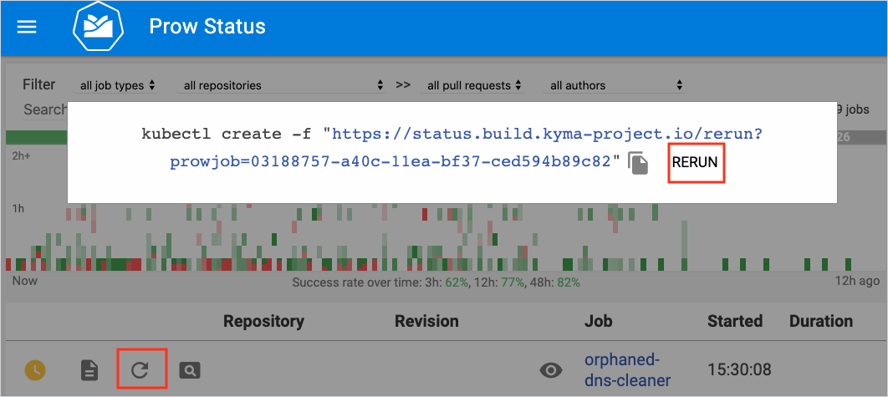

# Prow Jobs

This document provides an overview of Prow jobs.  

## Directory structure

Prow jobs reside in the `prow/jobs` directory in the `test-infra` repository. Job definitions are configured in YAML files. Prow jobs can be connected to specific components or be more general, like for integration jobs. General jobs are defined directly under the `jobs/{repository_name}` directories. Jobs configured for components are available in `jobs/{repository_name}`directories which include subdirectories representing each component and containing job definitions.


This is a sample directory structure:

```
...
prow
|- cluster
| |- starter.yaml
|- images
|- jobs
| |- kyma
| | |- components
| | | |- environments
| | | | |- environments.yaml
| | |- kyma.integration.yaml
|- scripts
|- config.yaml
|- plugins.yaml
...
```
> **NOTE:** All YAML files in the whole `jobs` structure need to have unique names.

## Job types

You can configure the following job types:

- **Presubmit** jobs run on pull requests (PRs). They validate changes against the target repository. By default, all presubmit jobs must pass before you can merge the PR.  If you set the **optional** parameter to `true`, a job becomes optional and you can still merge your PR even if the job fails.
- **Postsubmit** jobs are almost the same as the already defined presubmit jobs, but they run when you merge the PR. You can notice the difference in labels as postsubmit jobs use **preset-build-master** instead of **preset-build-pr**.
- **Periodic** jobs run automatically at a scheduled time. You don't need to modify or merge the PR to trigger them.

The presubmit and postsubmit jobs for a PR run in a random order. Their number in a PR depends on the configuration in the YAML file. You can check the job status on [`https://status.build.kyma-project.io/`](https://status.build.kyma-project.io/).


## Naming convention

When you define jobs for Prow, the **name** parameter of the job must follow one of these patterns:

- `{prefix}-{repository-name}-{path-to-component}` for components
- `{prefix}-{repository-name}` for jobs not connected to a particular component

You can extend the name of the job with a suffix to indicate the job's purpose. For example, write `pre-master-kyma-integration`.

Add `{prefix}` in front of all presubmit and postsubmit jobs. Use:
- `pre-master` for presubmit jobs that run against the `master` branch.
- `post-master` for postsubmit jobs that run against the `master` branch.
- `pre-rel{release-number}` for presubmit jobs that run against the release branches. For example, write `pre-rel06-kyma-components-api-controller`.


## Triggers

Prow runs presubmit and postsubmit jobs based on the following parameters:

- `always_run: true` for the job to run automatically at all times.
- `run_if_changed: {regular expression}` for the job to run if a PR modifies files matching the pattern. If a PR does not modify the files, this job sends a notification to GitHub with the information that the job is skipped.

**always_run** and **run_if_changed** are mutually exclusive. If you do not set one of them, you can only trigger the job manually by adding a comment to a PR.                                                               


## Interact with Prow

Prow allows you to use comments to rerun presubmit jobs on PRs.

> **NOTE:** You can rerun only presubmit jobs.

If you want to trigger your job again, add one of these comments to your PR:

`/test all` to rerun all tests
`/retest` to only rerun failed tests
`/test {test-name}` or `/retest {test-name}` to only rerun a specific test. For example, run `/test pre-master-kyma-components-binding-usage-controller`.

After you trigger the job, it appears on `https://status.build.kyma-project.io/`.


## Create jobs

Jobs are generated from templates stored in the `templates` directory. For details on how to configure templates, see [this](./manage-component-jobs-with-templates.md) document. To generate jobs, run this command in the root of the repository:

```
go run development/tools/cmd/rendertemplates/main.go --config templates/config.yaml
```

- For details on how to create jobs, see [Manage component jobs with templates](./manage-component-jobs-with-templates.md).
- For further reference, read a more technical insight into the Kubernetes [Prow jobs](https://github.com/kubernetes/test-infra/blob/master/prow/jobs.md).


## Rerun jobs from UI

All [cluster-access](https://github.com/orgs/kyma-project/teams/cluster-access) team members are authorized to rerun jobs from UI.




## Trigger jobs manually

In most situations, re-running the job means that Prow uses the same commit. To make sure the job uses the updated code base, you can trigger the job manually.
Use a tool called [mkpj](https://github.com/kubernetes/test-infra/tree/master/prow/cmd/mkpj) that generates a valid YAML for the Prow job. Follow these steps:

1. Clone the `kubernetes/test-infra` repository into the `k8s.io` directory. Run:

```shell
git clone "git@github.com:kubernetes/test-infra.git" $GOPATH/src/k8s.io
```

2. Reset the [compatible](./production-cluster-configuration.md#overview) `kubernetes/test-infra` state:

```shell
git reset <compatible commit sha> --hard
```

See the example of generating the `kyma-gke-nightly` target:

```shell
go run prow/cmd/mkpj/main.go --job=kyma-gke-nightly --config-path="$GOPATH/src/github.com/kyma-project/test-infra/prow/config.yaml" --job-config-path="$GOPATH/src/github.com/kyma-project/test-infra/prow/jobs/" > job.yaml
```

You can trigger this job manually. Run:
```shell
kubectl apply -f job.yaml
```

**NOTE**: Do not edit the generated YAML by hand. Modify the file under the `--job-config-path` parameter, and use [mkpj](https://github.com/kubernetes/test-infra/tree/master/prow/cmd/mkpj) again.
