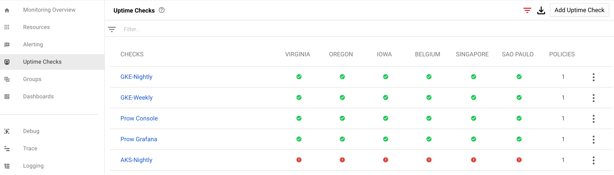
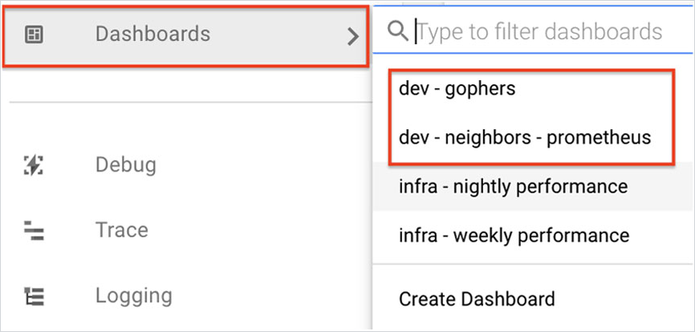

# Prow Cluster Monitoring Setup

This document describes how to install and manage Prow cluster monitoring. 

## Prerequisites

Install the following tools:

- kubectl

## Apply Monitoring Deployments

1. Apply the Prow namespace and the Prometheus operator deployment YAMLs in the following order:
```
prow_monitoring_namespace.yaml
prometheus_operator_rbac.yaml
prometheus_operator_deployment.yaml
```

2. Apply the Prow Prometheus configuration YAMLs in the following order:
```
prow_prometheus.yaml
prow_servicemonitors.yaml
prow_alertmanager.yaml
prometheus_expose.yaml
```

## Stackdriver Monitoring

Stackdriver Monitoring service provides additional metrics and data related to Prow and workload clusters.

### `sap-kyma-prow-workload` Workspace

The [`sap-kyma-prow-workload`](https://app.google.stackdriver.com/?project=sap-kyma-prow-workloads) workspace is used for two purposes:
 - Short-living GKE clusters, which are used to test jobs
 - Long-running GKE clusters (`weekly` and `nightly` clusters)

#### Dashboards
Stackdriver Monitoring provides information about the overall [status](https://app.google.stackdriver.com/uptime?project=sap-kyma-prow-workloads).
of long-running clusters and test-infra infrastructure:
 



Kyma developers have the necessary permissions to create custom dashboards in the `sap-kyma-prow-workload` workspace, however, it is required to follow the `dev - {team_name}` convention to name a dashboard. See the example:



#### Metrics Explorer

[Metrics explorer](https://cloud.google.com/monitoring/charts/metrics-explorer) allows you to build ad-hoc charts for any metric collected by the project.
Stackdriver provides a set of built-in metric types. [Here](https://cloud.google.com/monitoring/api/metrics) you can see the list of available metrics.

#### Log-Based Metrics

You can create log-based metrics on any outcome that was printed to logs from any GKE cluster.
This means that you can grab any logs from our long and short-living clusters and create a metric. 
It can count occurrences of a particular error or aggregate numbers extracted from the message.

Creating new log-based metrics is possible and requires creating a new [issue](https://github.com/kyma-project/test-infra/issues/new/choose) to the **Neighbors** team.

#### Prometheus Collector
Gathering additional metrics requires [Stackdriver Prometheus collector](https://cloud.google.com/monitoring/kubernetes-engine/prometheus). 
Adding the `--enable-stackdriver-kubernetes` flag is required for enabling the Stackdriver Kubernetes Engine Monitoring support on a Kubernetes cluster. 

Collecting all the data is not possible due to high costs, therefore there is a metric [filter](https://github.com/kyma-project/test-infra/blob/97f2b403f3e2ae6a4309da7e2293430f555442e8/prow/scripts/resources/prometheus-operator-stackdriver-patch.yaml) applied to limit the volume of data sent to the Stackdriver.

#### Alerting Policies
Stackdriver Monitoring allows you to set up alerting policies that send notifications through multiple communication channels, such as email or Slack.
The time of sending a notification is determined by criteria that have to be met to trigger an alert. It is possible to define complex criteria by using multiple rules and logical operators.
Triggering alerts can be based on different sources, such as regular monitoring metrics, log-based metrics, or uptime checks.

To see the currently active alerts, go to the [incidents dashboard](https://app.google.stackdriver.com/incidents?project=sap-kyma-prow-workloads).
