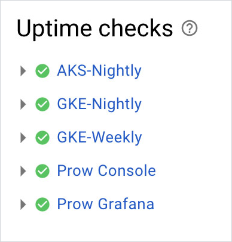

# Prow Cluster Monitoring Setup

This document describes how to install and manage Prow cluster monitoring that is available at `https://monitoring.build.kyma-project.io`. 
This document also describes how to create and manage Grafana dashboards.

## Prerequisites

Install the following tools:

- kubectl
- [jsonnet](https://jsonnet.org) and [jsonnet-bundler](https://github.com/jsonnet-bundler/jsonnet-bundler) installed

## Create dashboards ConfigMaps

The steps assume you have completed the prerequisites.

1. Make sure your kubectl context is set to a correct cluster.
2. Go to the [prow/cluster/components/monitoring](../../prow/cluster/components/monitoring) directory and run the command:
```shell
jb install
```
This will download all required dependencies for generating Grafana dashboards.

2. Once the command is done, run the following commands:
```shell
make generate_dashboards
make apply_configmaps
```
Those commands will generate json dashboards to the `dashboards_out` directory and apply them as ConfigMaps to the kubernetes cluster.

3. Once everything is done, run `make clean` to remove the generated json files.

## Apply monitoring deployments

1. If needed, generate a new Grafana password with command `openssl rand -hex 12` and paste it as `password` value in the [`grafana_secret.yaml`](../../prow/cluster/components/monitoring/grafana_secret.yaml) file.

2. Apply Prow namespace and Grafana deployment YAMLs in the following order:
```
prow_monitoring_namespace.yaml
grafana_rbac.yaml
grafana_configmaps.yaml
grafana_secret.yaml
grafana_deployment.yaml
monitoring_kyma-prow_managedcertificate.yaml
grafana_expose.yaml
```
This will create a Grafana instance that will be exposed under https://monitoring.build.kyma-project.io.

3. Apply the Prometheus operator deployment YAMLs in the following order:
```
prometheus_operator_rbac.yaml
prometheus_operator_deployment.yaml
```

4. Apply the Prow Prometheus configuration YAMLs in the following order:
```
prow_prometheus.yaml
prow_servicemonitors.yaml
prow_alertmanager.yaml
prometheus_expose.yaml
```

5. After successfully applying the monitoring configuration files, open the Grafana dashboard.
   
   Grafana dashboard is available at `https://monitoring.build.kyma-project.io`. It can take some time till the dashboard is accessible.

## Authenticate to Grafana

By default, Grafana dashboards are visible for anonymous users with the read-only access. Only authenticated users are able to create and edit dashboards. To sign in to Grafana, follow this steps:

1. The password will be set to the one from the `grafana_secret.yaml` you generated from the previous step one. Get the password for the `adm` user from the cluster:

   ```bash
   kubectl -n prow-monitoring get secret grafana -o jsonpath="{.data.password}" | base64 -D
   ```

2. Go to `https://monitoring.build.kyma-project.io/login`.

3. Provide credentials:

   ```
   Login: adm
   Password: {The value from step 1}
   ```

## Create and edit Grafana dashboards

To create or edit Grafana dashboards you must be signed in. The [official Grafana documentation](http://docs.grafana.org/guides/getting_started/) provides instructions on how to work with the dashboards. The main difference between the official guidelines and the the Kyma implementation of Grafana dashboards is the way in which you store them.

Follow these steps to save the dashboard:

1. Export the dashboard to a JSON format.

2. Save the JSON file under `prow/cluster/components/monitoring/dashboards/` and create ConfigMap out of it.
   ```bash
   kubectl -n prow-monitoring create configmap "grafana-dashboard-new" --from-file="prow/cluster/components/monitoring/dashboards/quality/new.json   ```
3. Update the `prow/cluster/components/monitoring/grafana_deployment.yaml` with newly created ConfigMap and update Grafana deployment manually.
   
   ```bash
   kubectl apply -f prow/cluster/components/monitoring/grafana_deployment.yaml
   ```
4. Do the rolling restart of Grafana deployment.

   ```bash
   kubectl -n prow-monitoring rollout restart deployment grafana
   ```
## Add recording and alerting rules

1. Add new recording or alerting rules to the [Prometheus Rule specification](../../prow/cluster/resources/monitoring/templates/prow_prometheusrules.yaml).

2. Replace the existing Prometheus Rule object with the current file version.
   ```bash
   kubctl replace -f prow/cluster/resources/monitoring/templates/prow_prometheusrules.yaml
   ```
## Stackdriver Monitoring

Stackdriver Monitoring service provides additional metrics and data related to Prow and workload clusters.

### `sap-kyma-prow-workload` workspace

The [`sap-kyma-prow-workload`](https://app.google.stackdriver.com/?project=sap-kyma-prow-workloads) workspace is used for two purposes:
 - Short-living GKE clusters, which are used to test jobs
 - Long-running GKE clusters (`weekly` and `nightly` clusters)

#### Dashboards
Stackdriver Monitoring dashboards provide visibility into the performance, uptime, and overall health of long-running Kyma test clusters. Here are the available dashboards:
 - For the [nightly cluster](https://app.google.stackdriver.com/dashboards/2395169590273002360?project=sap-kyma-prow-workloads)
 - For the [weekly cluster](https://app.google.stackdriver.com/dashboards/7169385145780812191?project=sap-kyma-prow-workloads)

Stackdriver Monitoring also provides information about overall [status](https://app.google.stackdriver.com/uptime?project=sap-kyma-prow-workloads) 
of long-running clusters and test-infra infrastructure:
 



Kyma developers have the necessary permissions to create custom dashboards in the `sap-kyma-prow-workload` workspace, however, it is required to follow the `dev - {team_name}` convention to name a dashboard. See the example:


#### Metrics explorer

[Metrics explorer](https://cloud.google.com/monitoring/charts/metrics-explorer) allows you to build ad-hoc charts for any metric collected by the project.
Stackdriver provides a set of built-in metric types. [Here](https://cloud.google.com/monitoring/api/metrics) you can see the list of available metrics.

#### Log-based metrics

You can create log-based metrics on any outcome that was printed to logs from any GKE cluster.
This means that you can grab any logs from our long and short-living clusters and create a metric. 
It can count occurrences of a particular error or aggregate numbers extracted from the message.

Creating new log-based metrics is possible and requires creating a new [issue](https://github.com/kyma-project/test-infra/issues/new/choose) to the **Neighbors** team.

#### Prometheus collector
Gathering additional metrics requires [Stackdriver Prometheus collector](https://cloud.google.com/monitoring/kubernetes-engine/prometheus). 
Adding the `--enable-stackdriver-kubernetes` flag is required for enabling the Stackdriver Kubernetes Engine Monitoring support on a Kubernetes cluster. 

Collecting all the data is not possible due to high costs, therefore there is a metric [filter](https://github.com/kyma-project/test-infra/blob/97f2b403f3e2ae6a4309da7e2293430f555442e8/prow/scripts/resources/prometheus-operator-stackdriver-patch.yaml#L14) applied to limit the volume of data sent to the Stackdriver.

#### Alerting policies
Stackdriver Monitoring allows you to set up alerting policies that send notifications through multiple communication channels, such as email or Slack.
The time of sending a notification is determined by criteria that have to be met to trigger an alert. It is possible to define complex criteria by using multiple rules and logical operators.
Triggering alerts can be based on different sources, such as regular monitoring metrics, log-based metrics, or uptime checks.

To see the currently active alerts, go to the [incidents dashboard](https://app.google.stackdriver.com/incidents?project=sap-kyma-prow-workloads).

### `sap-kyma-prow` workspace

Data collected in the `sap-kyma-prow` workspace are mainly Prow performance metrics and metrics that are based on the content of log entries. They help to track the ongoing and most common issues.

Although the workspace is not available for Kyma developers, they can see the following dashboards: 
 - [Prow cluster performance](https://storage.cloud.google.com/kyma-prow-logs/stats/index.html?authuser=1&orgonly=true) 
 - [Prow infrastructure log-based checks](https://storage.cloud.google.com/kyma-prow-logs/stats/checks.html?authuser=1&orgonly=true)
