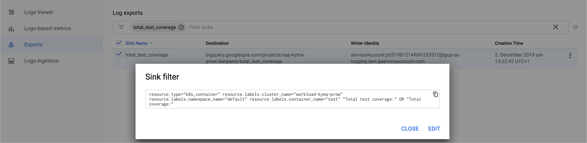

# Quality metrics

More information about topics related to gathering quality metrics can be found in [this epic](https://github.com/kyma-project/kyma/issues/5472)

## Test Coverage

Code coverage metrics are gathered directly from component build logs.
In the output of (almost) every job there is the "Total test coverage: xx%" string.


Since all logs from build infrastructure are gathered by Stackdriver, the build-in "export" (data sink) feature is used to filter out all these lines and send them to BigQuery:



Following SQL statement aggregates data to present comparison between last and previous test coverage:
```SQL
SELECT
     distinct k8s_pod_prow_k8s_io_job
   , FIRST_VALUE(val)
       OVER w1 AS last_result
   , NTH_VALUE(val,2)
       OVER w1 AS previous_result
   , FIRST_VALUE(timestamp)
       OVER w1 AS last_timestamp
   , NTH_VALUE(timestamp, 2)
       OVER w1 AS previous_timestamp
   , format("https://status.build.kyma-project.io/?job=%s", k8s_pod_prow_k8s_io_job)  as link
FROM 
(
  SELECT
      MIN(CAST(REGEXP_EXTRACT(textPayload, r"(\d{1,2})") as int64)) as val
    , labels.k8s_pod_prow_k8s_io_job as k8s_pod_prow_k8s_io_job
    , MAX(timestamp) as timestamp
  FROM `sap-kyma-prow.total_test_coverage.stdout`
  GROUP BY resource.labels.pod_name, labels.k8s_pod_prow_k8s_io_job
) main
where k8s_pod_prow_k8s_io_job not like 'pre%'
  WINDOW w1 AS (
    PARTITION BY k8s_pod_prow_k8s_io_job ORDER BY timestamp DESC
    ROWS BETWEEN UNBOUNDED PRECEDING AND UNBOUNDED FOLLOWING)
order by 2 desc
```

This query is used as a data source for a report created in DataStudio.
You can check this report here: https://datastudio.google.com/open/1TmjzxgO8yTGVdG5kQ0Y-99M-bBysfyTR


## Bugs and regression metrics

[GithubStats application](https://github.com/kyma-project/test-infra/tree/master/development/tools/cmd/githubstats) 
is used to gather data on bugs and regressions. It is executed as a [Prow job](https://status.build.kyma-project.io/?job=github-stats) once a day. The data are grabbed by Stackdriver export (data sink) and forwarded to BigQuery.
JSON object is automatically flattened into multiple columns. 

ProwJob creates the following output:
```
{
  "Issues": {
    "Open": {
      "TotalCount": 387,
      "Bugs": 45,
      "PriorityCritical": 0,
      "Regressions": 0,
      "TestFailing": 6,
      "TestMissing": 11
    },
    "Closed": {
      "TotalCount": 2245,
      "Bugs": 502,
      "PriorityCritical": 128,
      "Regressions": 0,
      "TestFailing": 100,
      "TestMissing": 34
    }
  },
  "Type": "GithubIssuesStatsReport",
  "Owner": "kyma-project",
  "Repository": "kyma",
  "Timestamp": "2019-12-11T06:01:18.770743384Z"
}
```
Following SQL statement is used to pre-format data:

```
select 
    CAST(jsonPayload.issues.open.totalcount as int64) as open
  , CAST(jsonPayload.issues.closed.totalcount as int64) as closed
  , CAST(jsonPayload.issues.open.bugs as int64) as open_bugs
  , CAST(jsonPayload.issues.open.regressions as int64) as open_regressions
  , CAST((jsonPayload.issues.open.totalcount + jsonPayload.issues.closed.totalcount) as int64) as totalcount
  , jsonPayload.timestamp
  , CONCAT(jsonPayload.owner, "/", jsonPayload.repository) as repository
from `sap-kyma-prow.stats_github.stdout`
order by jsonPayload.timestamp desc	
```

Above query is used as a data source for a report created in DataStudio.
You can check this report here: https://datastudio.google.com/open/1YbERoxkmrpLBPHpf00CINKcETkV810Tg
