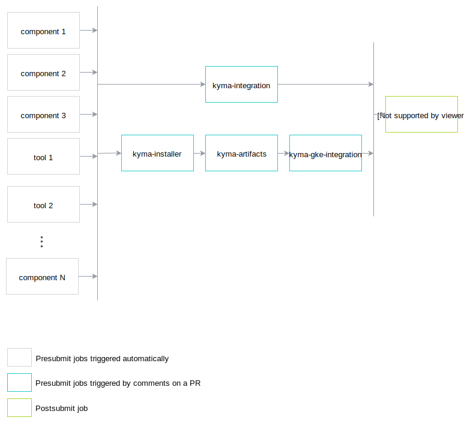

#Release checklist

This document describes how to execute release of Kyma using prow.

## Release preparation

This part can be done at any point of time. 
This part applies only for new major and minor versions.

1. Define release jobs in test-infra repository
 - for every component
 - for every tool
 - kyma-integration
 - kyma-gke-integration
 - kyma-artifacts
 - kyma-installer

To see all release jobs for release 0.6, look for job names with prefix: `pre-rel06`.
Every job name has to have unique name, so remember about prefixing it with `pre-rel<XY>`

2. Ensure that tests for jobs exist
3. Define branch protection rules for the release branch.
For release-0.6 definition was following:
```
release-0.6:
  protect: true
  required_status_checks:
    contexts:
      - pre-rel06-kyma-integration
      - pre-rel06-kyma-gke-integration
      - pre-rel06-kyma-artifacts
      - pre-rel06-kyma-installer
```


## Release

5. Create release branch in test-infra repository.
This part applies only for new major and minor versions.
The name of this branch should follow the `release-x.y` pattern, such as `release-0.6`.

4. Ensure that `RELEASE_VERSION` file contains version to be created.

1. Create a release branch in the `kyma` repository. Do it only for a new release, not for a bugfix release.
The name of this branch should follow the `release-x.y` pattern, such as `release-0.6`.

2. Create a PR for the `kyma` release branch. This triggers all jobs for components.
In PR you have to update version and directory of used components in `values.yaml` files.

Change from:

```
dir: develop/
version: acb1e829
```
to:
```
dir:
version: 0.6.0-rc1
```    
    
Every component image is published with a version defined in the `RELEASE_VERSION` file stored in the `test-infra` repository on the given release branch. For example, it can include the `0.6.0-rc1` version.

3. In case of a temporary failure of any job, you can retrigger it by adding a comment:
```
test <job_name>
```

3. Wait until all components for jobs or tools will be finished. 
`kyma-integration`, `kyma-gke-integration`, `kyma-artifacts` and `kyma-installer` needs to be executed manually, because there
are dependencies between jobs. See diagram: 

4.  Execute `kyma-integration` by adding comment on PR:
`/test pre-rel06-kyma-integration`

5. Execute one after the other `kyma-installer`, `kyma-artifacts` and `kyma-gke-integration` jobs

5. Let assume a situation that problem appears and integration test failed or manual test detected any problems.
Then you need to wait for the fix (fixed on PR or cherry picked to the PR). Then all jobs will be triggered one more time
and you need to return to point 2.

6. After all checks passed merge PR.

7. Merge to the release branch executes postsubmit job that creates github release.
Validate configured yamls and generated changelog: https://github.com/kyma-project/kyma/releases
Update manually release content with instruction how to install released kyma.

8. Update `RELEASE_VERSION` to next version immediately after the release. If not, any PR to release branch done by 
Kyma developer override previously published Docker images.  
