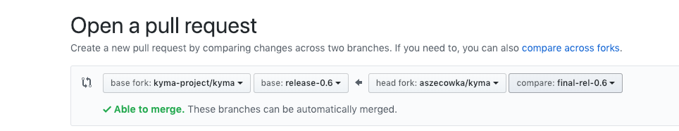

# Release Process

This document describes how to execute a Kyma release using Prow.

## Release preparation

This section only applies to new major and minor versions. Follow the preparation steps at any point in time.

1. Define these release jobs in the `test-infra` repository:
 - for every component
 - for every tool
 - for every test
 - `kyma-docs`
 - `kyma-integration`
 - `kyma-gke-integration`
 - `kyma-artifacts`
 - `kyma-installer`
 
To see all release jobs for the 0.6 release, look for job names with the `pre-rel06` prefix.
Since every job name has to be unique, prefix it with `pre-rel{XY}`.
Define the release jobs on the `master` branch since Prow reads the job configuration from the `master` branch of the `test-infra` repository.

2. Ensure that tests for release jobs exist. Release tests usually iterate through all release versions and run tests for them.
See the `TestBucReleases` test defined in `development/tools/jobs/kyma/binding_usage_controller_test.go` as a reference.
To add tests for all jobs for the new release, update the `GetAllKymaReleaseBranches()` function
  defined in the `development/tools/jobs/tester/tester.go` file under
the `test-infra` repository.

3. Define branch protection rules for the release branch in the `prow/config.yaml` file.
For example, see the release-0.6 definition:
```
release-0.6:
  protect: true
  required_status_checks:
    contexts:
      - pre-rel06-kyma-integration
      - pre-rel06-kyma-gke-integration
      - pre-rel06-kyma-artifacts
      - pre-rel06-kyma-installer
```


## Release

Follow these steps to create a release:
1. Create a release branch in the `test-infra` repository.
This point only applies to new major and minor versions.
The name of this branch should follow the `release-x.y` pattern, such as `release-0.6`.

2. Ensure that the `prow/RELEASE_VERSION` file from the `test-infra` repository on a release branch contains the correct version to be created.
The file should contain a release version following `{A}.{B}.{C}` or `{A}.{B}.{C}-rc{D}` format, where `A`,`B`, `C`, and `D` are numbers.
If you define a release candidate version, a pre-release is created.

3. Create a release branch in the `kyma` repository. Do it only for a new release, not for a bugfix release.
The name of this branch should follow the `release-x.y` pattern, such as `release-0.6`.

4. Create a PR for the `kyma` release branch.


This triggers all jobs for components.
Update your PR with the version and the directory of components used in `values.yaml` files.

Change these values in the files:

```
dir: develop/
version: {current_version}
```
Replace them with:
```
dir:
version: {rel_version}
```    
    
Every component image is published with a version defined in the `RELEASE_VERSION` file stored in the `test-infra` repository on the given release branch. 

5. If any job fails, retrigger it by adding the following comment to the PR:
```
/test {job_name}
```

6.  Wait until all jobs for components and tools finish. 
`kyma-integration`, `kyma-gke-integration`, `kyma-artifacts`, and `kyma-installer` needs to be executed manually because there
are dependencies between these jobs. See the diagram for details: 


7.  Execute `kyma-integration` by adding comment on PR:
`/test pre-rel06-kyma-integration`

8. Execute one after the other `kyma-installer`, `kyma-artifacts` and `kyma-gke-integration` jobs. 
You don't have to wait until `pre-rel06-kyma-integration` job will be finished.

5. In case of  detecting problems with a release, for example failing tests, you need to wait for the fix (fixed on PR or cherry picked to the PR). 
Then all jobs will be triggered one more time and you need to return to point 6.

9. After all checks pass, merge PR.

10. Merge to the release branch, executes Postsubmit job that creates a Github release.
Validate generated `yamls` and changelog files: https://github.com/kyma-project/kyma/releases
Update manually release content with instruction how to install released Kyma.

11. Update `RELEASE_VERSION` to next version immediately after the release, both on master and release branch. If not, any PR to a release branch done by 
Kyma developer overrides previously published Docker images.  
