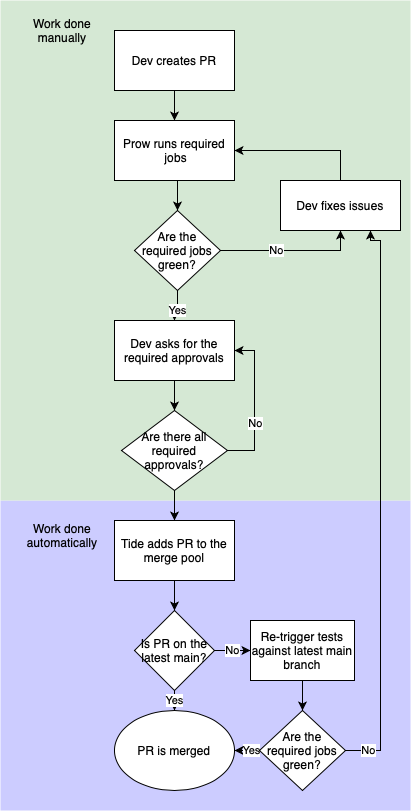

# Tide Introduction

Along with the Prow upgrade, we want to introduce Tide for merging the PRs automatically.
Tide is a Prow component that handles merging the PRs once all the requirements are met. 

> **NOTE:** Tide is a mandatory component for Prow and introducing it is needed in the upgrade process.

### How Tide Works

Every PR introduced to the watched repository has a new pending context called `tide`. The context stays in the pending state until the PR has passed all the requirements and is in the merge pool.

Tide merges the approved PRs sequentially (one by one).
Tide then rebases a working branch with the latest revision of the `main` branch and runs the required tests. This ensures the changes are going to work even after being merged.

### Issues

This workflow assumes no-one has write access to the GitHub repositories. Unfortunately, due to some blocking limitations in the `approve` plugin, we need to do several workarounds.

- We will still use GitHub's `CODEOWNERS` workflow with manual approvals from the GitHub UI. That means write access to the repository cannot be revoked. This will require developers **NOT TO** merge PRs manually.
- Tide's context will be set to `Required`, so the PRs can't be merged prematurely. This, however, still allows for merging the PR manually once the PR is in the merge pool (Tide's context is green).
- Skipped jobs will not be reported to GitHub. The `run_if_changed` jobs will be seen as optional to GitHub, but Tide will require them before merging the PR (that's why Tide's context is set to required).

### Workflow

This is how the workflow looks like from the developer's perspective:

1. Create a PR.
2. After the required jobs have passed, ask for approvals from the code owners.
3. Once the PR gets all the required approvals, Tide adds the PR to the merge pool.
4. Before the merge, if your branch is older than the latest `main` branch, Tide re-runs the jobs against your rebased branch.
5. Once the checks have passed again, the PR is automatically merged.
6. If you don't want the PR to be merged automatically, you have to use the `/hold` command to your PR. This command adds the label that blocks automatic branch merging. To remove this label, use the `/hold cancel` command.

### Next Steps

After upgrading Prow and Tide to the most up-to-date branch, we would like to take further steps in increasing the development workflow quality:

1. Introduce organization-wide label sync - a static set of labels used by automation tools and the bot command on GitHub across the whole organization.
2. Introduce the `approve` plugin. With it, we'll be able to revoke write access from the repositories. It's not doable until the `approve` plugin is rewritten.
